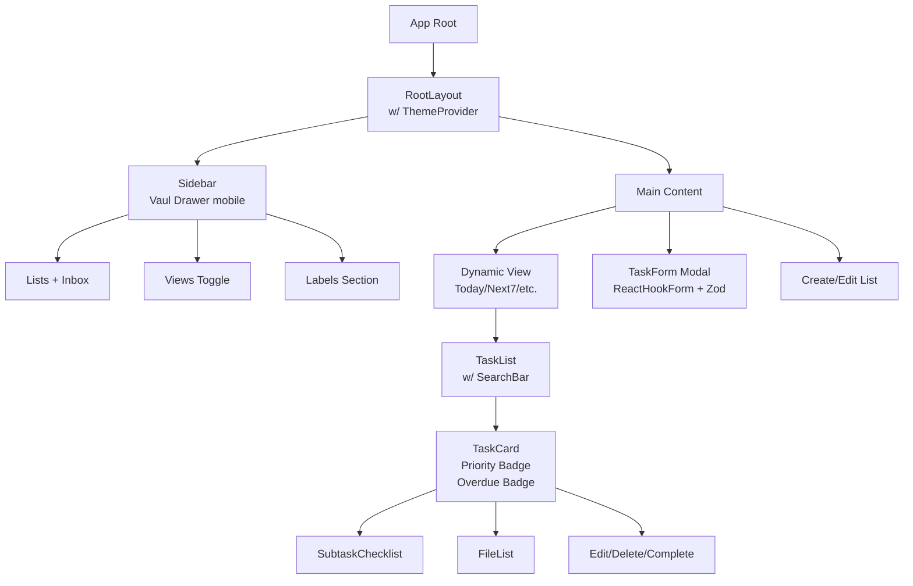

# Daily Task Planner - Technical Specification

## Recommended Stack Additions

Core stack: Next.js 16 (App Router), Bun, TypeScript (strict), Tailwind CSS, shadcn/ui, Framer Motion.

**Additional Dependencies:**

- **ORM/DB:** [`drizzle-orm`](https://orm.drizzle.team/docs/overview) + [`drizzle-kit`](https://orm.drizzle.team/kit-docs/overview) + `better-sqlite3` (Local SQLite in repo)
- **Icons:** [`lucide-react`](https://lucide.dev/guide/packages/lucide-react)
- **Search:** [`fuse.js`](https://fusejs.io/) (Fuzzy search on tasks/lists)
- **Dates:** [`date-fns`](https://date-fns.org/) (Formatting, parsing, manipulation)
- **State:** [`zustand`](https://zustand-demo.pmnd.rs/) (Global state for tasks/lists/UI)
- **Forms/Validation:** [`react-hook-form`](https://react-hook-form.com/) + [`zod`](https://zod.dev/) (Type-safe forms)
- **UI Extras:** [`vaul`](https://vaul.snowork.com/) (Drawers/sheets for mobile sidebar/task details), [`next-themes`](https://github.com/pacocoursey/next-themes) (Themes)
- **Utils:** `@radix-ui/react-*` (via shadcn), `clsx`, `tailwind-merge`
- **Tests:** Bun Test (unit/integration), Vitest optional for React components

**Dev Deps:** `@types/node`, `typescript`, `@tailwindcss/vite`, `drizzle-kit`

## Project Folder Structure

```
todo-planner/
├── app/                  # App Router pages & layouts
│   ├── (views)/          # Parallel routes for views (Today, Next7, etc.)
│   │   ├── inbox/        # Default Inbox view
│   │   ├── today/
│   │   ├── next7/
│   │   ├── upcoming/
│   │   └── all/
│   ├── layout.tsx
│   ├── page.tsx          # Landing/redirect to Inbox
│   ├── globals.css
│   └── favicon.ico
├── components/           # Reusable UI components
│   ├── ui/               # shadcn/ui components (Button, Input, etc.)
│   ├── sidebar/          # SidebarNav, ListItem, ViewToggle
│   ├── tasks/            # TaskCard, TaskForm, SubtaskList
│   ├── views/            # ViewRenderer, TaskList, EmptyState
│   └── modals/           # TaskModal, ListModal, ConfirmDelete
├── lib/                  # Utilities & config
│   ├── db/               # Drizzle setup
│   │   ├── index.ts
│   │   ├── schema.ts     # DB schema
│   │   └── seed.ts
│   ├── actions.ts        # Server Actions (CRUD)
│   ├── store.ts          # Zustand stores
│   ├── utils.ts          # Date utils, cn(), etc.
│   └── fuse.ts           # Fuse.js instance
├── types/                # TypeScript types
│   └── index.ts          # Task, List, etc.
├── public/               # Static assets
├── tests/                # Bun tests
│   ├── unit/
│   ├── integration/
│   └── utils/
├── drizzle.config.ts
├── next.config.js
├── tailwind.config.js
├── tsconfig.json
├── bun.lockb
└── README.md
```

## Database Schema

Single-user local SQLite (`db.sqlite` in root, gitignored data but schema in repo).

**Tables (12 total):**

- `lists` (Inbox + custom)
- `tasks` (core tasks)
- `subtasks` (hierarchical)
- `task_labels` (many-to-many)
- `labels` (global/multi-use)
- `attachments` (file refs)
- `reminders` (per-task)
- `task_logs` (change history)
- `views_config` (user prefs for views)
- `recurring_rules` (patterns)
- `task_recurrences` (instances)
- `settings` (theme, etc.)

**Key Relations:**

- tasks → lists (FK)
- subtasks → tasks (FK)
- task_labels ↔ labels/tasks
- attachments/reminders → tasks (FK)
- task_logs → tasks (FK)

**Mermaid ER Diagram:**

```mermaid
erDiagram
    lists ||--o{ tasks : "contains"
    tasks ||--o{ subtasks : "has"
    tasks }o--o{ task_labels : "links"
    labels ||--o{ task_labels : "used_in"
    tasks ||--o{ attachments : "has"
    tasks ||--o{ reminders : "has"
    tasks ||--o{ task_logs : "logs"
    tasks ||--o{ task_recurrences : "generates"
    recurring_rules ||--o{ task_recurrences : "defines"
    settings ||--|| users : "for"  %% Optional single-user

    lists {
        integer id PK
        varchar name
        varchar color
        string emoji
        timestamp created_at
    }
    tasks {
        integer id PK
        integer list_id FK
        varchar name
        text description
        date due_date
        time estimate_time
        time actual_time
        enum priority
        json recurring_options
    }
```

**Drizzle Schema Snippet (`lib/db/schema.ts`):**

```typescript
import {
  sqliteTable,
  text,
  integer,
  int,
  real,
  sqliteDateType,
} from "drizzle-orm/sqlite-core";

export const lists = sqliteTable("lists", {
  id: integer("id").primaryKey({ autoIncrement: true }),
  name: text("name").notNull(),
  color: text("color", { length: 7 }).notNull(), // #hex
  emoji: text("emoji"),
  createdAt: text("created_at").default("CURRENT_TIMESTAMP").notNull(),
});

export const tasks = sqliteTable("tasks", {
  id: integer("id").primaryKey({ autoIncrement: true }),
  listId: integer("list_id")
    .references(() => lists.id)
    .notNull(),
  name: text("name").notNull(),
  description: text("description"),
  dueDate: text("due_date"), // ISO date
  deadline: text("deadline"), // ISO datetime
  estimateTime: text("estimate_time", { length: 5 }).default("00:00"), // HH:mm
  actualTime: text("actual_time", { length: 5 }),
  priority: text("priority", {
    enum: ["high", "medium", "low", "none"],
  }).default("none"),
  completed: integer("completed", { mode: "boolean" }).default(false),
  completedAt: text("completed_at"),
  recurringOptions: text("recurring_options"), // JSON
  createdAt: text("created_at").default("CURRENT_TIMESTAMP").notNull(),
  updatedAt: text("updated_at").default("CURRENT_TIMESTAMP").notNull(),
});

// Indexes
export const tasksDueIndex = index("tasks_due_date_idx").on(tasks.dueDate);
export const tasksListIndex = index("tasks_list_id_idx").on(tasks.listId);
```

**Migrations:** `drizzle-kit generate:sqlite` → `drizzle-kit push:sqlite`

## Component Breakdown/Hierarchy

**Mermaid Component Tree:**



**Key Components (~20+):**

- UI primitives: Button, Input, Card, Badge, DatePicker (shadcn)
- TaskCard (Framer Motion hover/animations)
- SidebarNav (collapsible, responsive)
- SearchInput (Fuse.js debounce)
- ViewFilters (Today toggle completed, etc.)

## Data Flow

- **Fetching:** Server Components (RSC) query DB via Drizzle → serialized to client
- **Mutations:** Server Actions (`actions.ts`) for CRUD → `revalidatePath('/')` + optimistic Zustand updates
- **Optimistic Updates:** Zustand `mutate` before action, rollback on error
- **Hydration:** `useHydrateStore` pattern for initial RSC data → Zustand
- **No tRPC** (keep simple; Server Actions suffice for App Router)
- **Search:** Client-side Fuse.js on Zustand tasks
- **Sync:** Polling or `useEffect` on focus for local DB

## State Management

- **Global (Zustand):** `useTaskStore` (tasks, lists, labels, searchQuery, activeView, theme)
  - Slice for UI (sidebarOpen, modals)
  - Persist middleware (localStorage)
- **Local:** React state for forms (TaskForm), hover states
- **Context:** ThemeProvider (next-themes)

**Snippet (`lib/store.ts`):**

```typescript
import { create } from "zustand";
import { persist } from "zustand/middleware";

interface TaskStore {
  tasks: Task[];
  lists: List[];
  // ...
  setTasks: (tasks: Task[]) => void;
  addTask: (task: Task) => void;
  optimisticUpdateTask: (id: number, updates: Partial<Task>) => void;
}

export const useTaskStore = create<TaskStore>()(
  persist(
    (set, get) => ({
      tasks: [],
      // ...
    }),
    { name: "task-planner-store" }
  )
);
```

## Key Implementations

- **Views Filtering/Sorting:** Client-side (Zustand selector) by due_date, priority, list_id, completed. Overdue: `dueDate < today && !completed`
- **Recurring Logic:** On complete → create next instance via Server Action (daily/weekly/monthly JSON rules)
- **Change Logging:** On every update → insert to `task_logs` (diff old/new)
- **Fuzzy Search:** Fuse.js on `tasks` (keys: name, desc, labels)
- **Themes:** `next-themes` w/ system default, Tailwind dark: variants
- **Animations:** Framer Motion (TaskCard slide-in, sidebar push, View Transitions API)
- **Responsive:** Tailwind (sidebar hidden→drawer on mobile), `sm:` breakpoints
- **Date Picker:** shadcn DatePicker + date-fns
- **NL Entry (Stretch):** Integrate later w/ MCP or API

## Setup Steps

1. `bun create next-app@16 todo-planner --ts --tailwind --app`
2. `cd todo-planner`
3. `bun add drizzle-orm better-sqlite3 lucide-react fuse.js date-fns zustand react-hook-form zod vaul next-themes framer-motion`
4. `bun add -d drizzle-kit @types/better-sqlite3 typescript`
5. `npx shadcn-ui@latest init` (w/ Tailwind, dark mode)
6. `npx shadcn-ui@latest add button input card badge popover dialog calendar`
7. Setup `drizzle.config.ts`, `lib/db/`, run `bunx drizzle-kit generate:sqlite && bunx drizzle-kit push:sqlite`
8. `bunx shadcn-ui@latest add drawer` (mobile sidebar)
9. Theme: Add `next-themes` to layout
10. Run `bun dev`

## Test Plan

- **Unit (Bun Test):** Utils (date-fns wrappers, fuse search), Zod schemas, pure functions
- **Integration:** DB ops (Drizzle queries/actions), Server Actions (mock DB)
- **Component (Vitest + @testing-library/react):** TaskCard render, form validation, animations (msw for actions)
- **E2E (Playwright/Cypress optional):** Full flows (create task, views switch), but Bun Test for speed
- Coverage: 80%+, focus CRUD, edge (overdue, recurring)

**Bun Test Example:**

```bash
bun test --coverage
```

## File Patterns for Modes

- **Architect:** `*.md`
- **Code:** `*.tsx|*.ts|*.js|*.json|*.css|drizzle.config.ts`
- **Debug:** All + logs
- **Frontend Specialist:** `app/**/*.tsx|components/**/*.tsx`

This spec ensures scalable, performant, type-safe app with minimal deps.
